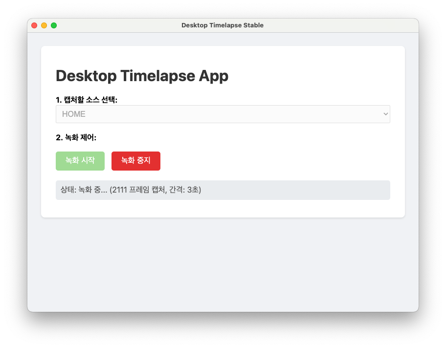
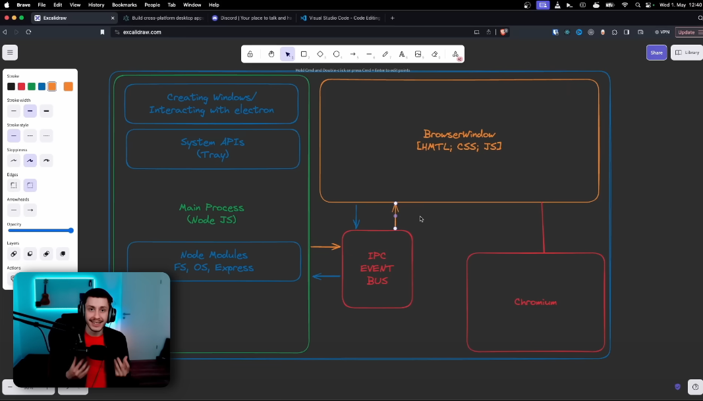

# 어떤 데스크탑 앱을 만들기로 하였는지? 왜 만들기로 하였는지?

우선 나는 요즘 캠스터디에 아주 푹 빠져있는데, 이전에 프로젝트도 내가 하는 모든 화면을 공유하고 싶어서 웹 기반 화면 공유 템플릿 사이트 (캠스터디 사이트)를 만들어서 배포했다. (친구들이랑 매번 잘 쓰는 중). 나는 맥에서 캠을 공유할 때 휴대폰 카메라를 통해 공유하는데, 아이폰의 타임랩스 기능으로 내가 공부하는 모습을 찍어보고 싶은 욕구가 생겼다. 하지만 그렇게 되면 캠스터디를 할 때 캠 외의 다른 화면만 공유해야하는 문제도 있고, 무엇보다 거치대를 어느 위치에 달아야할지 모르겠어서 고민을 하다가 그냥 내 캠스터디 웹을 그냥 통째로 타임랩스로 찍는 프로그램을 만들기로 했다.

# Electron에 대해 간단히 알아보고 넘어가자

Electron은 **JavaScript, HTML, CSS를 사용하여 데스크톱 애플리케이션을 구축하기 위한 프레임워크**이다.
JavaScript 코드베이스를 유지하면서 Windows, macOS, Linux에서 작동하는 크로스 플랫폼 앱을 만들 수 있게 합니다. 네이티브 개발 경험이 필요하지 않다고 한다.
즉, 웹 기술로 데스크탑 앱을 만들 수 있다는 것인데 (물론! Electron 만의 지켜야할 규칙이 있겠지만) Electron 공식 문서를 보면 웹 기술을 선택해야하는 내용이 있다. 웹 기술이 사용자 인터페이스를 구축하는데 최적의 선택으로 부상하였다는 내용과 'HTML과 CSS는 개발자와 디자이너의 역량을 충분히 발휘할 수 있또록 해준다.', '웹 기술은 가장 많이 사용되는 UI 기반이기 때문에 현대의 컴퓨터는 CPU에서 운영체제에 이르기까지 웹 기술 실행에 최적화 되어있다', '상호운용성', '보급성 (많은 개발자가 웹 기술을 사용하기 때문에 이와 관련된 문제를 검색하고 해결하는데 까지 온라인에서 충분히 찾을 수 있음)' 등을 이야기 한다. 궁금하시면 한번 글을 읽어보시길 바란다.

그리고 왜 Electron을 사용하는지에 대한 내용도 있는데 '신뢰성, 보안, 안정성, 성숙도'를 가지고 있다고 합니다. 이 내용도 딱히 짚고 넘어가지는 않겠습니다.

## Electron 기본

Electron은 두개의 프로세스로 나눌 수 있는데 하나는 '메인 프로세스' 또 하나는 '렌더러 프로세스'이다.

이 둘이 하는 역할에 관해 알아보자.

### 메인 프로세스

- 애플리케이션의 생명주기를 관리하고, 네이티브 기능 OS기능 (메뉴, 파일 시스템 등)에 접근
- `BrowserWinodw 인스턴스를 생성하여 렌더러 프로세스를 만듦
- Node.js API를 직접 사용할 수 있음

### 렌더러 프로세스

- `BrowserWindow` 내에서 실행되는 웹페이지
- 사용자 인터페이스를 담당
- 보안상의 이유로 직접적인 Node.js API 접근 제한

추가적으로 '프로세스 간 통신 (IPC)' 가 있는데 아주 중요합니다.

### 프로세스 간 통신

- 메인 프로세스와 렌더러 프로세스는 서로 격리되어 있어 직접적인 함수 호출이 불가능하기 때문에 이 둘 간의 통신을 위해서는 IPC 매커니즘 사용
- `ipcMain`과 `ipcRenderer` : Electron에서 제공하는 모듈로, 채널 기반으로 비동기적인 메세지를 주고받음
- Preload 스크립트
  - 렌더러 프로세스가 로드되기 전에 실행되는 스크립트. 렌더러의 전역 객체에 특정 함수나 데이터를 안전하게 노출시키는 역할
  - **Electron의 메인 프로세스는 운영 체제에 대한 완전한 접근 권한을 가진 Node.js 환경**
  - Electron 모듈 외에도 Node.js 내장 기능과 npm을 통해 설치된 모든 패키지에 접근할 수 있음
  - **Electron의 서로 다른 프로세스 유형을 연결하기 위해서는 프리로드(preload)라는 특수 스크립트를 사용해야 함**

# 짧게 타임랩스 데모 버전 만들어보면서 익히기

우선 튜토리얼과 문서들을 보면서 간단하게 프로그램을 만들고 빌드하는 것 과정까지 해보았다.



좀 못생기긴 했지만... 일단 어떻게 해야할지 간단한 코드 위에서 연습을 해보았다.

현재 기능은 드롭다운으로 화면과 스크린 모두 제목을 띄워서 사용자가 선택한 뒤 녹화시작을 누르면 해당 스크린혹은 윈도우를 캡쳐한다. 시간이 지날 수록 캡쳐하는 주기가 늘어난다. 최대 5초까지만 늘어나게 해두었다.

녹화가 중지되면 캡쳐한 파일들을 모아서 1분 내외의 동영상으로 만들어준다.

(타임랩스 프로그램 화면이 최소화되도 계속 캡쳐가 되게 하는 방법 등도 추가 되어있다)

# 나는 어떻게 실제 프로젝트를 설정할 것인가

사실 어떻게 보면 타임랩스 실전 프로젝트도 연습이라고 볼 수 있다. 내가 구축한 캠스터디 프로젝트를 일렉트론으로 데스크탑 앱으로도 배포하고 싶기 때문에 좀 더 작은 작업을 하면서 익숙함을 키우고자 했다.

어쨌든 그래서 확장성 및 나중을 대비하여 Vite + React + TypeScript + Electron 으로 프로젝트를 진행하기로 하였다.

우선 이를 실행하기 위해 유튜브 강의 영상과 블로그 글을 참고하였는데,



우선 강의 시작 전에 Electron 작동 원리? 에 대한 전반을 그림으로 알려줘서 이해하기가 더욱 쉬웠다.
하지만 코드를 따라가다보니 실제로 개발하면서 계속 빌드해서 미리보기를 실행할 수 있는 구조라서 다른 방법을 찾기로 했다.

[Build an Electron app using Vite, TypeScript and React](https://medium.com/@selfint/build-an-electron-app-using-vite-typescript-and-react-e98f7fc1babd)

위의 글을 보고 차근차근히 프로젝트 초기 설정을 마치게 되었다.

사실 유튜브 강의에서 설정하다가 넘어가서 어느정도 섞여있긴 하다.

최종적으로 내가 해둔 설정으로는,

React 빌드 결과, Electron 빌드 결과 나누기

src/electron/tsconfig.json

```json
{
  "compilerOptions": {
    "strict": true,
    "target": "esnext",
    "module": "nodenext",
    "outDir": "../../dist-electron",
    "skipLibCheck": true
  }
}
```

vite.config.ts

```ts
import { defineConfig } from "vite";
import react from "@vitejs/plugin-react";
import tailwindcss from "@tailwindcss/vite";

// https://vite.dev/config/
export default defineConfig({
  plugins: [react(), tailwindcss()],
  base: "./",
  build: {
    outDir: "dist-react",
  },
});
```

```json
{
  // 나머지 생략
  "scripts": {
    "dev:react": "vite",
    "dev:electron": "electron .",
    "lint": "eslint .",
    "transpile:electron": "tsc --project src/electron/tsconfig.json",
    "dev": "concurrently \"vite\" \"cross-env DEV= tsc-watch -p src/electron/tsconfig.json --onSuccess \\\"electron .\\\"\"",
    "preview": "vite build && tsc -p src/electron/tsconfig.json && cross-env PREVIEW= electron .",
    "build": "vite build && tsc -p src/electron/tsconfig.json && electron-forge make"
  }
}
```

src/electron/main.ts

```ts
const isDev = process.env.DEV != undefined;
const isPreview = process.env.PREVIEW != undefined;

const createWindow = () => {
  const win = new BrowserWindow({
    width: 800,
    height: 600,
    webPreferences: {
      preload: path.join(__dirname, "preload.js"),
    },
  });

  if (isDev) {
    win.loadURL("http://localhost:5173");
    win.webContents.openDevTools();
  } else if (isPreview) {
    win.webContents.openDevTools();
    win.loadFile("dist-electron/main");
  } else {
    win.loadFile("dist-electron/main");
  }
};
```

# 참고

[🎥 Electron Course - Code Desktop Applications (inc. React and Typescript)](https://www.youtube.com/watch?v=fP-371MN0Ck)
[📝Build an Electron app using Vite, TypeScript and React](https://medium.com/@selfint/build-an-electron-app-using-vite-typescript-and-react-e98f7fc1babd)
